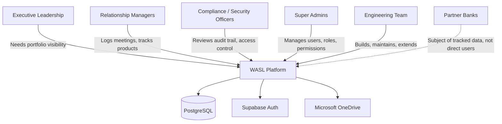

# Stakeholder Analysis

## Stakeholder Map

## Stakeholder Roles & Interests

| Stakeholder | Role in System | Primary Interest | Access Level |
|---|---|---|---|
| **Executive Leadership** | Consumer of dashboard/KPIs | Portfolio health at a glance, risk exposure | `dashboard_access`, typically `admin`/`manager` role |
| **Relationship Managers** | Day-to-day operators | Log meetings, update product/bank status, manage documents | `dashboard_access`, `meetings`, `documents` |
| **Compliance / Security Officers** | Oversight | Verify who accessed/changed what, when | `security` permission (Activity Timeline) |
| **Super Admins** | System administrators | Create/manage user accounts, assign roles & permissions | `super_admin` role + `user_management` permission + PIN |
| **Engineering Team** | Builders/maintainers | Extend features safely, understand system boundaries | Full codebase access, not a runtime role |
| **Partner Banks** | Subject of records | Not direct system users — represented as data (banks, products, meetings, documents) | No access |

## RACI for Key Processes

| Process | Responsible | Accountable | Consulted | Informed |
|---|---|---|---|---|
| Bank onboarding (new bank record) | Relationship Manager | Manager/Admin | Compliance | Executives |
| Product status update | Relationship Manager | Manager | — | Executives (via dashboard) |
| Document upload/archive | Relationship Manager | Manager/Admin | Compliance | — |
| User account creation | Super Admin | Super Admin | — | Manager |
| Role/permission change | Super Admin | Super Admin | Compliance | Affected user |
| Bank/meeting/document archive or restore | Manager/Admin (per role config) | Super Admin | Compliance | — |

## Stakeholder Concerns Addressed by the System

- **Executives** worry about visibility gaps → addressed via live dashboard KPIs and Kanban/grid/list views.
- **Compliance** worries about unauthorized access or untracked changes → addressed via audit logging and granular permissions.
- **Super Admins** worry about accidental or malicious privilege escalation → addressed via server-side permission normalization and the PIN-gated second factor for user management.
- **Engineering** worries about maintainability → addressed by this documentation package and the modular monorepo structure.
