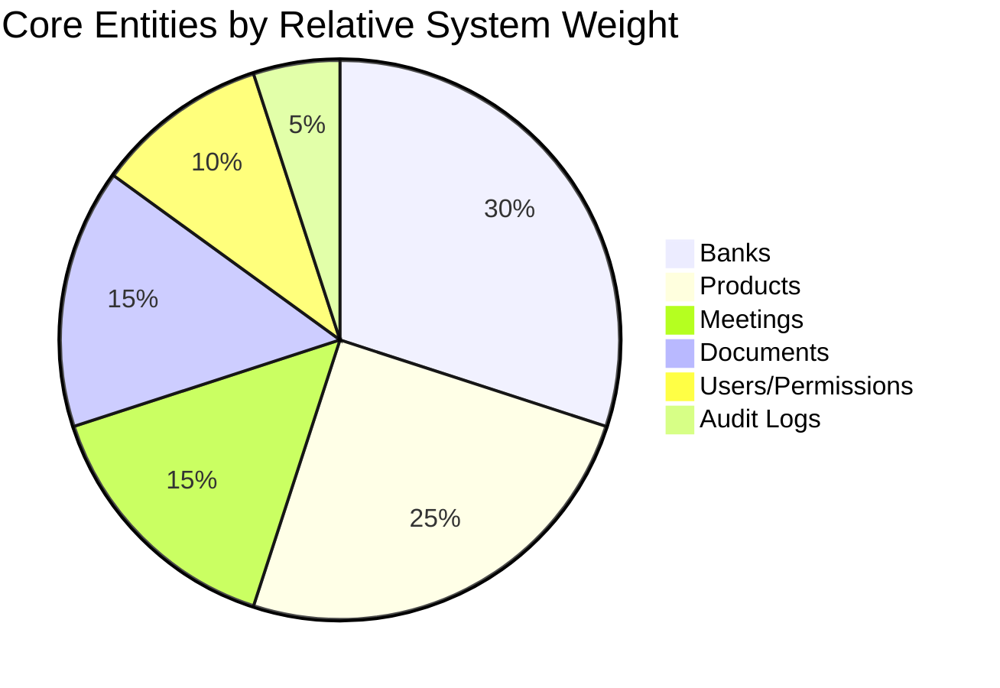

# Business Domain Discovery

## Domain Context

WASL operates in the **banking partnership / vendor relationship management** domain, specifically for an organization that integrates with multiple banks (as partners, not as a bank itself). The domain blends elements of:

- **CRM** (relationship tracking, meetings, contacts)
- **Project/Program management** (product rollout status, progress, risk, delays)
- **Document management & compliance** (contracts, compliance files, audit trail)
- **Identity & access governance** (roles, permissions, admin oversight)

## Core Domain Concepts

| Concept | Definition |
|---|---|
| **Bank** | A partner financial institution being onboarded/integrated with. Has a bilingual name, category, status, risk level, priority impact, contacts, and a logo/hero image. |
| **Product** | A specific banking product or integration being rolled out with a given bank (e.g., a card product, a payment rail). Has its own status, progress percentage, risk level, and category stage. |
| **Product Type** | A global catalog entry (e.g., "Credit Card", "Instant Payments") that can be associated with many banks via a many-to-many relationship. |
| **Meeting** | A recorded interaction with a bank — date, topic, summary, attendees, status. |
| **Document** ("File") | Metadata for a file stored in OneDrive, polymorphically linked to a bank, product, or meeting. |
| **Action Item** | A task tied to a bank, with owner, due date, and status — tracks follow-up work from meetings/products. |
| **Risk** | A tracked risk record tied to a bank, with description, level, and status. |
| **Audit Log Entry** | An immutable record of a create/update/archive/restore action performed by a user. |
| **User / Profile** | An internal staff account with a role and a set of granular permissions. |

## Domain Language (Ubiquitous Language)

- **"Archive"** — a soft delete; the record is hidden from default views but preserved and restorable. Never a hard delete for banks, meetings, or documents.
- **"Restore"** — reversing an archive action.
- **"Activity Timeline"** — the audit log surfaced in the UI (previously mislabeled "Security & Activity").
- **"Portfolio"** — the dashboard's collective view of all banks (`/portfolio` route).
- **"Risk Level"** — a categorical assessment (e.g., low/medium/high) applied to both banks and products.
- **"Progress Percent"** — a numeric 0–100 measure of how complete a product's integration is.

## Domain Boundaries

**In-domain**: bank relationship lifecycle, product rollout tracking, meeting records, document lifecycle, internal user access governance, audit history.

**Out-of-domain**: actual financial transaction processing, direct bank-system integration (no live banking API calls), customer-facing functionality, multi-organization/tenant support.

## Domain Discovery — Entity Frequency (indicative of business focus)

