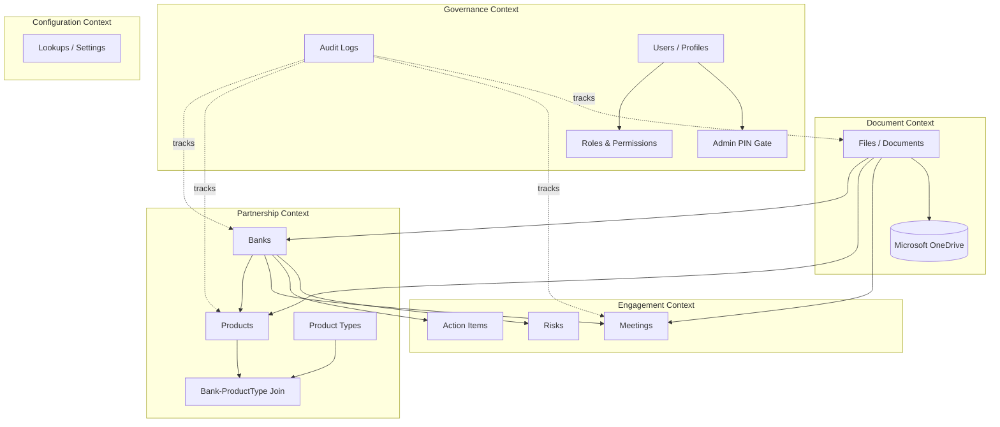

# Domain Mapping

## Bounded Contexts

WASL can be decomposed into the following bounded contexts, each with clear ownership of specific tables and routes.

## Context Responsibilities

| Context | Responsibility | Primary Tables | Primary Routes |
|---|---|---|---|
| **Partnership** | Track banks and the products/integrations rolled out with them | `banks`, `products`, `product_types`, `bank_product_types` | `/api/banks`, `/api/products`, `/api/product-types` |
| **Engagement** | Track interactions and follow-up work with banks | `meetings`, `action_items`, `risks` | `/api/meetings` |
| **Document** | Store and retrieve compliance/contract documents | `files` | `/api/documents`, `/api/files/content/:id` |
| **Governance** | Control who can see/do what, and record what happened | `audit_logs`, `profiles` (Supabase) | `/api/admin/users`, `/api/audit-logs` |
| **Configuration** | Manage shared dropdown/lookup values | `lookups` | `/api/settings/lookups` |

## Cross-Context Integration Points

- **Partnership → Document**: a bank or product can have associated files (polymorphic `entityType`/`entityId` on `files`).
- **Engagement → Document**: a meeting can have associated files (e.g., minutes, signed agreements).
- **Every context → Governance**: every mutating action across every context writes to `audit_logs`, and every read/write route is gated by the Governance context's permission model.
- **Partnership/Engagement/Document → Archive**: soft-delete state (`isArchived`) is a shared cross-context concept surfaced in a unified `/api/archive` view.

## Anti-Corruption Notes

- **Supabase vs. application DB**: Supabase is used strictly for authentication/identity (`profiles`, roles, permissions) — it is *not* the application's data store. The actual banking-domain data lives in the Replit-managed PostgreSQL database via Drizzle. This separation must be preserved; do not query Supabase for banks/products/meetings/documents.
- **OneDrive as storage, not source of truth for metadata**: OneDrive holds the actual file bytes; the `files` table is the source of truth for what documents exist and how they relate to domain entities. OneDrive links are always re-signed on read, never persisted as static public URLs.
