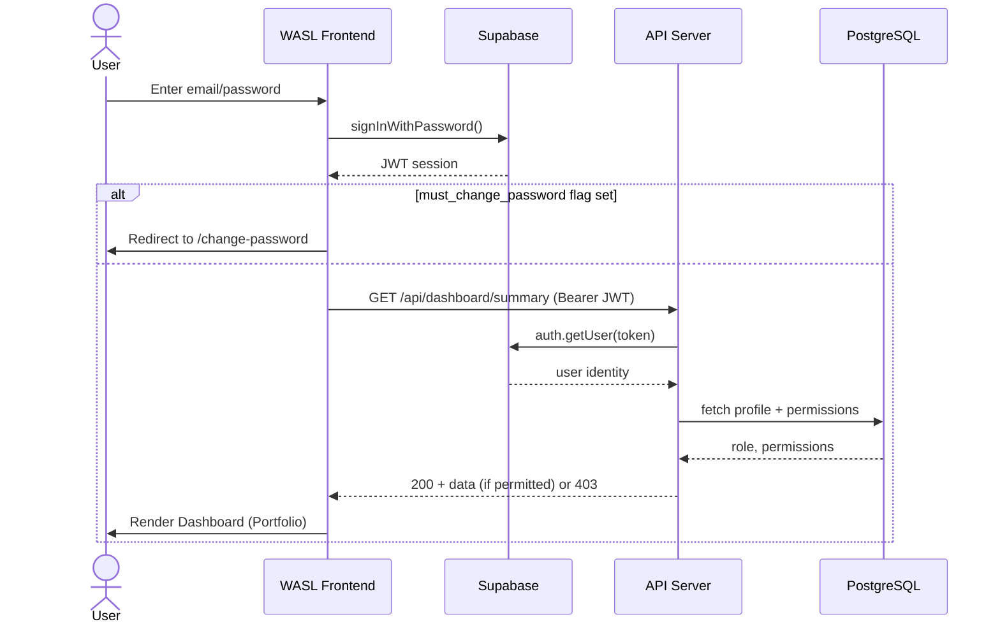
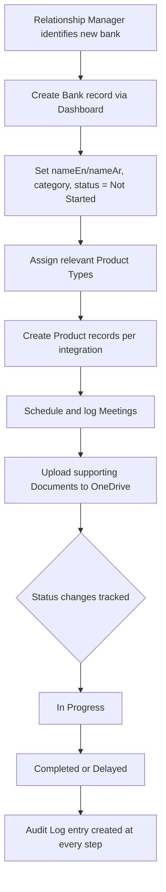
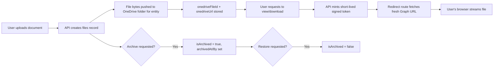
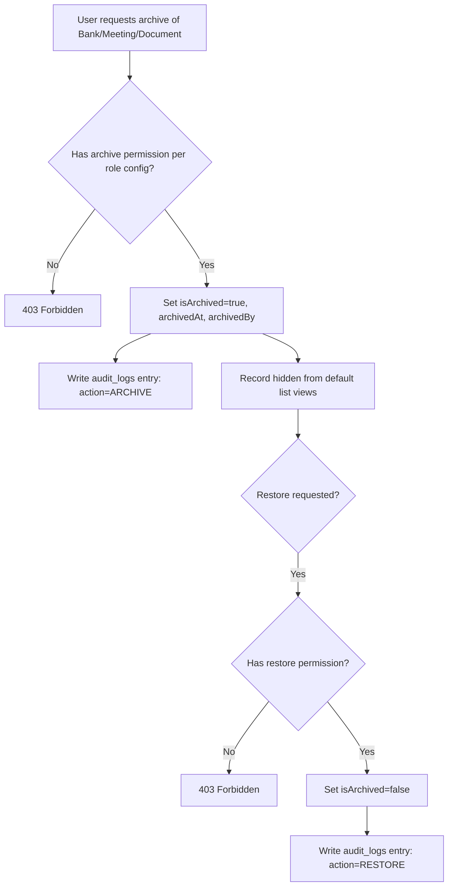
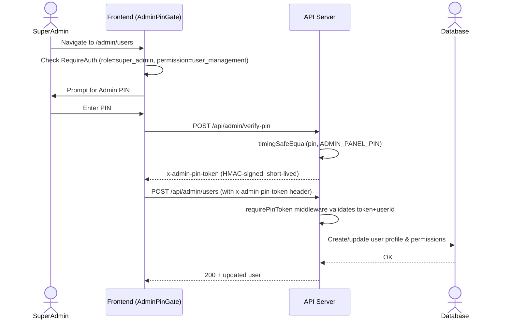

# Business Process Flows

## 1. User Login & Access Flow



## 2. Bank Onboarding Process



## 3. Document Lifecycle (OneDrive-backed)



## 4. Archive / Restore Governance Flow



## 5. Admin User Management (with PIN Second Factor)



## 6. Meeting & Follow-Up Process

```mermaid
flowchart TD
    A[Meeting occurs with bank] --> B[RM logs Meeting: date, topic, attendees, summary]
    B --> C{Action items identified?}
    C -->|Yes| D[Create Action Item: description, owner, due date]
    D --> E[Track status: Open/In Progress/Done]
    C -->|No| F[Meeting closed as informational]
    B --> G[Optionally attach Documents to meeting]
