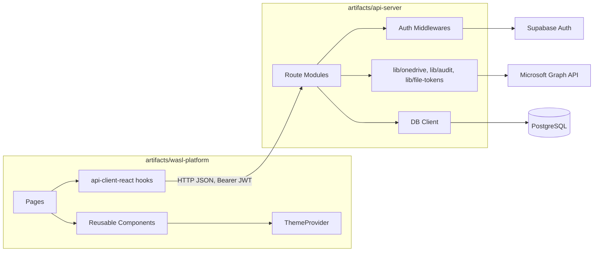
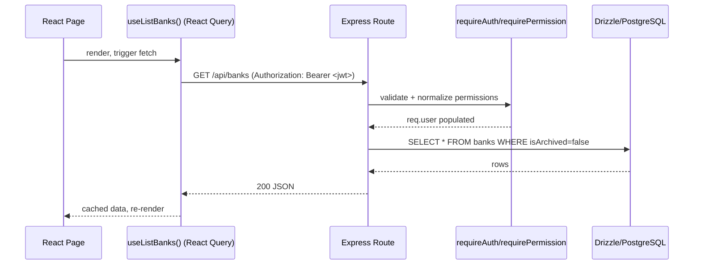

# Software Design Document (SDD)

## 1. Architectural Style

WASL follows a **layered client-server architecture** inside a **pnpm monorepo**:

- **Presentation layer**: React 19 + Vite SPA (`artifacts/wasl-platform`).
- **API layer**: Express 5 REST API (`artifacts/api-server`).
- **Data layer**: PostgreSQL via Drizzle ORM (`lib/db`).
- **Identity layer**: Supabase Auth (`lib/supabase`).
- **Shared contracts**: Zod schemas (`lib/api-zod`) shared between client and server for validation consistency.
- **Client data-access layer**: generated React Query hooks (`lib/api-client-react`) — the frontend never calls `fetch` directly against domain routes.

## 2. Module Decomposition

## 3. Key Design Decisions

| Decision | Rationale |
|---|---|
| Supabase for auth only, Postgres for domain data | Keeps identity concerns decoupled from business data; avoids vendor lock-in for the actual system of record |
| Soft delete (`isArchived`) instead of hard delete | Preserves compliance-relevant history; supports restore workflows |
| Polymorphic `files` table (`entityType` + `entityId`) | Avoids three near-duplicate document tables for bank/product/meeting attachments |
| Signed, short-lived redirect for OneDrive content | Bearer-only Graph auth can't be used in ``/`<a>` tags; a signed redirect re-mints a fresh Graph URL on every authenticated read instead of persisting a real (expiring, sensitive) Graph URL |
| Server-side permission normalization on every request | JSONB permissions merged with role defaults on every `requireAuth` call, so a stale/partial permissions object can never accidentally grant more than the role default |
| PIN-gated second factor for admin routes | Session hijacking or a compromised `super_admin` browser tab should not be sufficient to manage other users' access |
| Shared Zod schemas (`lib/api-zod`) | Single source of truth for validation on both client (form validation) and server (route validation), preventing drift |
| Generated React Query hooks (`lib/api-client-react`) | Type-safe, consistent data-fetching/caching pattern across all pages; avoids ad hoc fetch logic |

## 4. Data Flow — Typical Read Request

## 5. Error Handling Philosophy

- No silent fallbacks: a failed permission check returns 403, a missing record returns 404 — the frontend surfaces these as explicit toasts/errors, never blank/mocked data.
- Session expiry is explicitly detected (e.g., in `change-password.tsx`) and routes the user back to `/login` with a clear message rather than surfacing a raw Supabase error string.

## 6. Frontend Design System Notes

- "Arctic Glass" visual language: `.glass-panel` / `.glass-card` utility classes with theme-aware blur/opacity/border tokens.
- Theme state (`dark`/`light`) persisted to `localStorage`, toggled via `ThemeProvider`.
- All brand imagery (logo) is rendered from a single transparent-background asset (`WaslLogo` component) sized consistently across auth screens, sidebar, and dashboard header.
