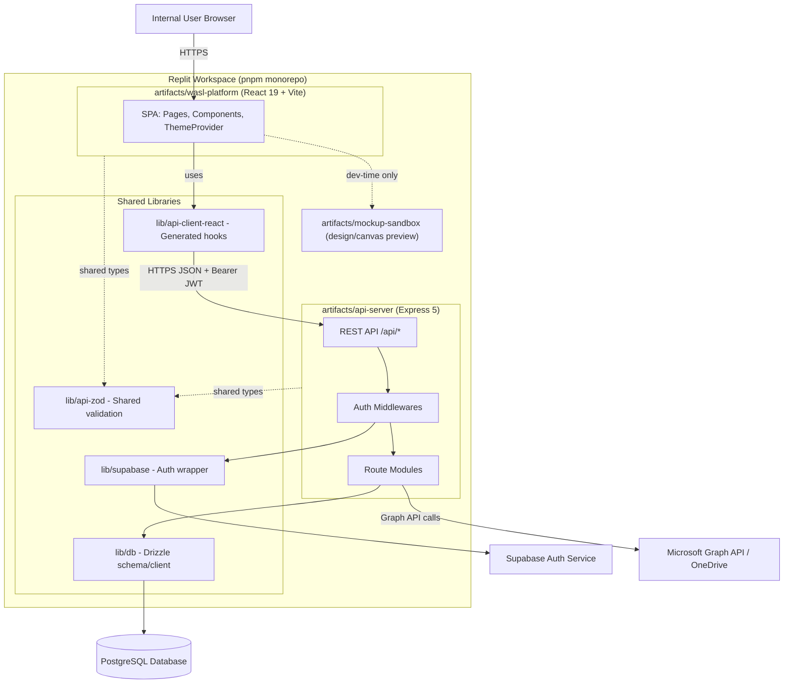

# System Architecture

## High-Level Architecture Diagram

## Runtime Topology

- **Single-page application**: served by Vite dev server in development, static build in production, routed under its artifact base path.
- **API server**: separate Express process, routed under `/api`, independently deployable/scalable.
- **Database**: a single PostgreSQL instance (Replit-managed), accessed only by the API server — the frontend never talks to Postgres directly.
- **Auth**: Supabase is a separate managed service; the frontend talks to it directly for login/session, and the API server verifies tokens server-side via Supabase's admin SDK.
- **File storage**: Microsoft OneDrive via Graph API, accessed only by the API server; the frontend never holds a direct Graph token.

## Request/Response Boundaries

| Boundary | Protocol | Auth |
|---|---|---|
| Browser ↔ Frontend static assets | HTTPS | None (public shell; routes gated client-side by `RequireAuth`) |
| Browser ↔ Supabase Auth | HTTPS | Email/password → JWT |
| Frontend ↔ API Server | HTTPS JSON | Bearer JWT (Supabase-issued) + optional `x-admin-pin-token` |
| API Server ↔ PostgreSQL | TCP (Drizzle client) | `DATABASE_URL` credential |
| API Server ↔ Supabase | HTTPS (admin SDK) | `SUPABASE_SERVICE_ROLE_KEY` |
| API Server ↔ Microsoft Graph | HTTPS | Replit connector-issued OAuth token |

## Environments

- **Development**: Replit workspace, workflows run `pnpm --filter ... run dev` for each artifact, hot-reloaded via Vite.
- **Production**: Replit autoscale deployment, built via `pnpm build` (typecheck + recursive build across all packages), served behind Replit's path-based router mapping `/api` to the server and `/` to the platform SPA.
