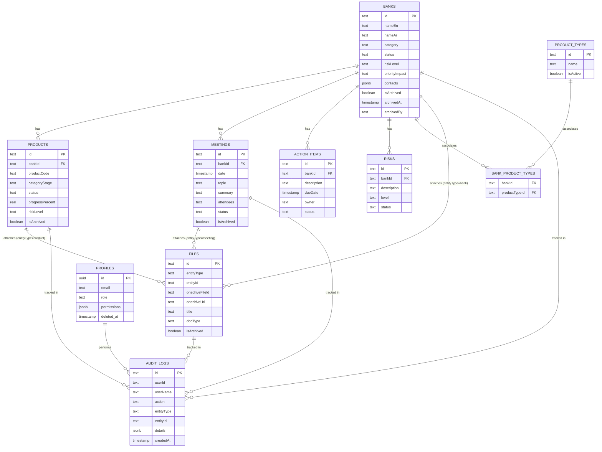

# Entity Relationship Diagram

## Relationship Summary

- **One-to-Many**: `BANKS → PRODUCTS`, `BANKS → MEETINGS`, `BANKS → ACTION_ITEMS`, `BANKS → RISKS`.
- **Many-to-Many**: `BANKS ↔ PRODUCT_TYPES` via `BANK_PRODUCT_TYPES`.
- **Polymorphic One-to-Many**: `FILES` attaches to exactly one of `BANKS`, `PRODUCTS`, or `MEETINGS`, disambiguated by `entityType`.
- **Audit fan-in**: `AUDIT_LOGS` references any domain entity plus the acting `PROFILES` user, forming a many-to-one relationship for traceability rather than a foreign-key-enforced structural relationship.
