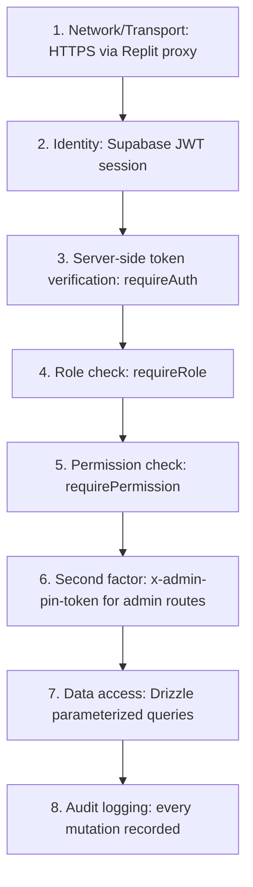

# Security Architecture

## Defense-in-Depth Layers

## 1. Authentication

- Supabase Auth issues JWTs on successful email/password login.
- The API server never trusts a client-asserted identity — every request re-verifies the Bearer token against Supabase (`supabase.auth.getUser()`).
- Deactivated accounts (`deleted_at` set) are rejected even with a still-valid JWT.

## 2. Authorization Model

- **Role** (`super_admin`, `admin`, `manager`, `editor`, `viewer`) — coarse-grained gate via `requireRole`.
- **Permission** (`user_management`, `documents`, `meetings`, `security`, `dashboard_access`) — fine-grained JSONB flags via `requirePermission`.
- **Normalization on every request**: stored permissions are merged onto the role's default permission set on every `requireAuth` call — a corrupted or partial permissions object can never grant more than the role default, only less.
- **Client-side gating is UX only**: `RequireAuth`/nav filtering in the frontend hides inaccessible routes/links, but every actual capability is re-enforced server-side. A hidden nav link is never the only protection for a sensitive route.

## 3. Second-Factor: Admin PIN Gate

- Independent of the Supabase session — protects against session hijacking or an unattended logged-in browser tab.
- Flow: `POST /api/admin/verify-pin` compares the submitted PIN to `ADMIN_PANEL_PIN` using `timingSafeEqual` (constant-time comparison, resistant to timing attacks).
- On success, issues a short-lived, HMAC-signed (`SESSION_SECRET`) `x-admin-pin-token` bound to the specific user ID.
- `requirePinToken` middleware enforces this token on all admin-user-management mutation routes — even a valid `super_admin` session cannot call these routes without it.

## 4. Document Security

- Files are stored in Microsoft OneDrive, not in the application database.
- OneDrive/Graph API is Bearer-token-only — it cannot be used directly in ``/`<a href>`, so the API server issues its own short-lived signed redirect token per read request.
- The real Graph download URL is **never persisted** and never exposed to the client directly — it is re-minted fresh on every authenticated read via `/api/files/content/:id`.

## 5. Data Integrity & Auditability

- All create/update/archive/restore operations write an entry to `audit_logs`, including actor identity, action type, entity type/id, and a details payload.
- Soft-delete (`isArchived`) preserves historical records rather than physically deleting them — supporting after-the-fact investigation.

## 6. Secrets Management

- All secrets (`SESSION_SECRET`, `ADMIN_PANEL_PIN`, `SUPABASE_SERVICE_ROLE_KEY`, `DATABASE_URL`, etc.) are managed via Replit's environment/secrets system — never hardcoded in source, never logged.

## 7. Known Risk Areas / Hardening Notes

- Supabase Row-Level Security (RLS) is **not** the primary access-control mechanism for domain data (banks/products/etc.) since that data lives in a separate Postgres instance managed via the API server — access control is enforced entirely in the Express middleware layer. Any future direct-to-Supabase writes must not bypass this.
- A self-update RLS policy on `profiles` (if ever added) must be column-aware to prevent a user from self-escalating their own `role`/`permissions` — current design routes all such writes through the service-role backend specifically to avoid this class of bug.
- File-upload validation must be applied on **every** write path that can set an image/file field (e.g. a general `PATCH` endpoint must re-validate the same way a dedicated `PUT /logo` endpoint does) — a validated dedicated endpoint does not implicitly protect a general one that accepts the same field.

## 8. Compliance Posture

The audit log, granular permissions, and PIN-gated admin actions collectively support internal governance and partner-oversight compliance requirements, giving a verifiable record of who could access or change partner-bank data and when.
