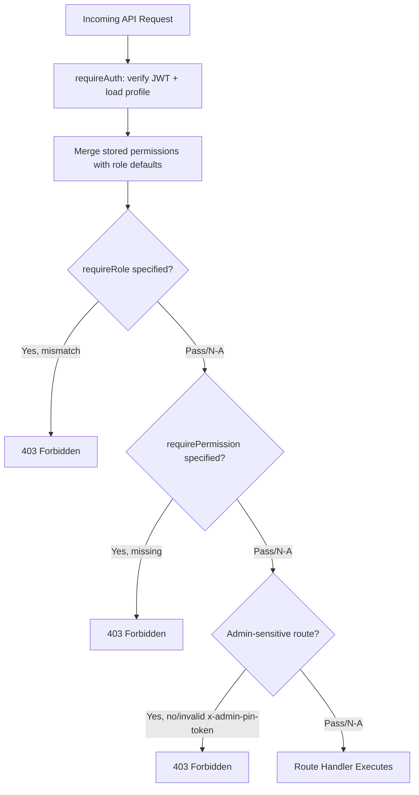

# User Roles and Permissions

## Roles

| Role | Description | Typical User |
|---|---|---|
| `super_admin` | Full system control, including user management and role/permission assignment | System owner / IT admin |
| `admin` | Broad operational access across banks, products, meetings, documents | Senior manager |
| `manager` | Manages a portfolio of banks and their products/meetings/documents | Relationship manager lead |
| `editor` | Can create/update records but with narrower scope than manager | Relationship manager |
| `viewer` | Read-only access | Executive / observer |

## Permission Flags (JSONB, per user)

| Permission Key | Grants Access To |
|---|---|
| `dashboard_access` | Portfolio dashboard, bank details, KPIs |
| `documents` | Document upload/view/archive/restore |
| `meetings` | Meeting log create/view/archive/restore |
| `security` | Activity Timeline (audit log) visibility |
| `user_management` | Admin Users page (also requires `super_admin` role + PIN) |

## Default Permission Matrix by Role

| Role | `dashboard_access` | `documents` | `meetings` | `security` | `user_management` |
|---|---|---|---|---|---|
| `super_admin` | ✅ | ✅ | ✅ | ✅ | ✅ |
| `admin` | ✅ | ✅ | ✅ | ✅ | ❌ |
| `manager` | ✅ | ✅ | ✅ | ❌ | ❌ |
| `editor` | ✅ | ✅ | ✅ | ❌ | ❌ |
| `viewer` | ✅ | ❌ | ❌ | ❌ | ❌ |

*Actual per-user permissions can be individually overridden (narrowed or, within role bounds, expanded) by a `super_admin`; the table above reflects role defaults used for normalization.*

## Enforcement Points

## Route-to-Permission Mapping (Summary)

| Route Group | Role Requirement | Permission Requirement |
|---|---|---|
| `/api/banks`, `/api/products` | any authenticated | `dashboard_access` |
| `/api/product-types` (write) | `super_admin` | `dashboard_access` |
| `/api/meetings` | any authenticated | `meetings` |
| `/api/documents`, `/api/files/content/:id` | any authenticated | `documents` |
| `/api/audit-logs` | any authenticated | `security` |
| `/api/admin/users` | `super_admin` | `user_management` + valid PIN token |
| `/api/dashboard/*` | any authenticated | `dashboard_access` |
| `/api/settings/lookups` | any authenticated | none beyond auth (read); admin-level for writes |

## UI-Level Reflection of Permissions

- Sidebar navigation items are filtered based on the current user's role/permissions (`Layout.tsx`), so users never see links to pages they cannot access.
- This is a UX convenience only — the corresponding API routes independently re-enforce the same rules, since a hidden link is not a security boundary.
