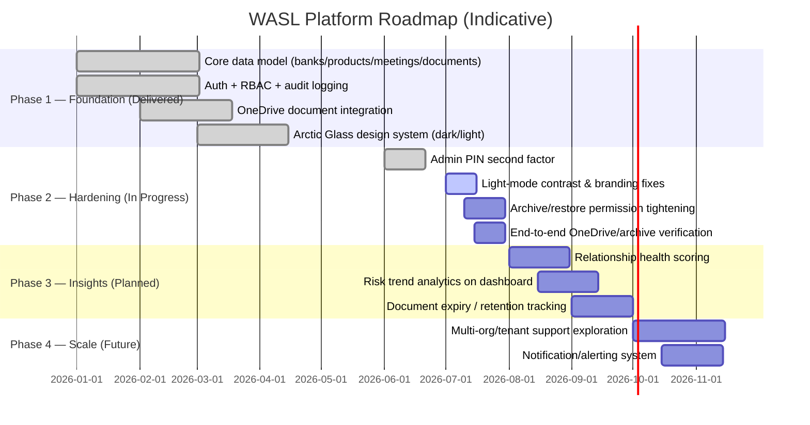

# Development Roadmap

## Roadmap Overview

## Phase 1 — Foundation (Delivered)
- Core domain model: banks, products, product types, meetings, documents, action items, risks.
- Authentication via Supabase; role + granular JSONB permission system.
- Audit logging across all mutating operations.
- OneDrive-backed document storage with signed-redirect access pattern.
- Arctic Glass design system across dark and light themes.

## Phase 2 — Hardening (In Progress, per active project tasks)
- Admin PIN second factor for sensitive user-management actions — delivered.
- Light-mode UI consistency and correct brand-logo treatment — delivered.
- **Restrict who can archive/restore banks, meetings, and documents** — in progress (project task).
- **Undo an accidental product-type deactivation** — in progress (project task).
- **End-to-end verification of OneDrive uploads and archive/restore flows with a real login** — in progress (project task).

## Phase 3 — Insights (Planned)
- Relationship health scoring combining status, risk, delay, and meeting cadence.
- Trend analytics for risk exposure across the bank portfolio.
- Document expiry / retention-policy tracking and reminders.

## Phase 4 — Scale (Future / Exploratory)
- Evaluate multi-organization/tenant support if the platform is adopted beyond the current organization.
- Notification/alerting for status changes, upcoming meetings, or overdue action items.
- Potential native mobile companion app (currently web-responsive only).

## Prioritization Principle

Hardening (security, permissions, auditability, data-integrity) is prioritized ahead of new feature surface area, consistent with the product's compliance-sensitive domain.
