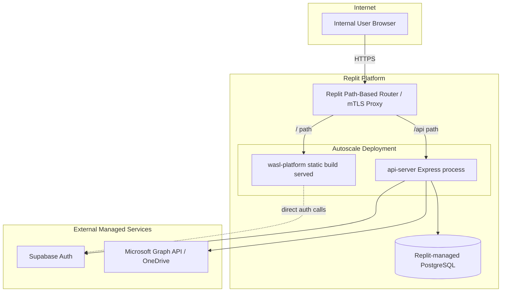
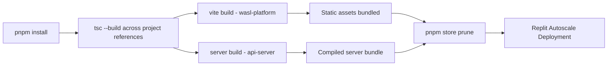

# Deployment Architecture

## Deployment Diagram

## Environments

| Environment | Purpose | Notes |
|---|---|---|
| **Development** | Live-editing workspace | Vite dev servers with HMR; workflows auto-restart on config changes |
| **Production** | Deployed, user-facing instance | Built artifacts served via Replit Autoscale; separate production database/session context |

## Build Pipeline

## Deployment Characteristics

- **Stateless API server**: no in-memory session state beyond short-lived PIN tokens (HMAC-verifiable, not server-memory-dependent) — safe to scale horizontally.
- **Path-based routing**: Replit's proxy maps `/` to the frontend artifact and `/api` to the backend artifact; frontend code must always use its base-path-aware URL helper rather than hardcoded root-relative paths.
- **Zero-downtime expectation**: Autoscale deployments replace instances; the app must not depend on local disk state (none currently does — all persistent state is in PostgreSQL or OneDrive).

## Rollback Strategy

- Replit checkpoints (codebase + database snapshots) provide a rollback path for both code and data if a deployment introduces a regression.
- Database schema changes should be additive and backward-compatible where possible to avoid requiring coordinated rollback of both code and schema.
