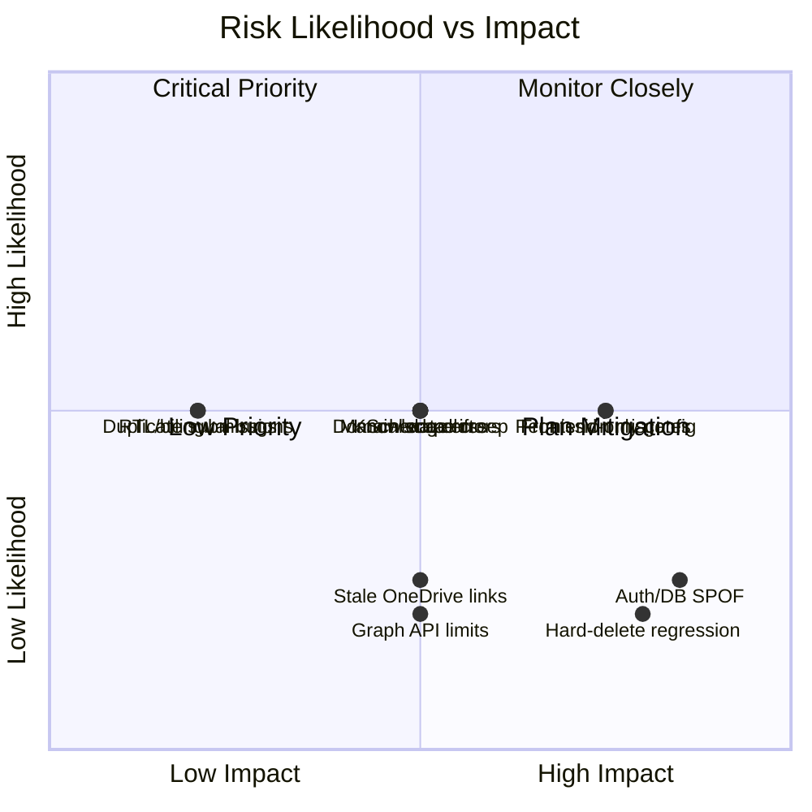

# Project Risks

## Risk Register

| # | Risk | Category | Likelihood | Impact | Mitigation |
|---|---|---|---|---|---|
| 1 | Single points of failure on Supabase Auth or PostgreSQL availability | Technical | Low | High | Both are managed services with their own SLAs; no local workarounds currently exist if either is down — document this dependency clearly to stakeholders |
| 2 | Permission misconfiguration granting excess access | Security | Medium | High | Server-side normalization against role defaults on every request; PIN gate for the most sensitive actions; recommend periodic access review by a super admin |
| 3 | Accidental hard-loss of data via a future "hard delete" feature added without care | Data Integrity | Low | High | Convention of soft-delete (`isArchived`) must be explicitly preserved in any new delete-like feature; document this convention for engineering teams |
| 4 | Stale/cached OneDrive links exposing document access after permission changes | Security | Low | Medium | Signed redirect tokens are short-lived and re-minted per request; no static Graph URL should ever be persisted or cached client-side |
| 5 | Schema drift between `lib/db` composite build artifacts and dependents after a schema change | Technical | Medium | Medium | Always run a full `tsc --build --force` on `lib/db` (and dependents) after schema changes, not just `drizzle push`, to avoid stale type-driven runtime bugs |
| 6 | Client-side-only protection mistaken for real security in future feature work | Security | Medium | High | Standing convention: every sensitive UI gate (nav hiding, PIN prompts) must be backed by an equivalent server-side check; code review should catch any "frontend-only gate" |
| 7 | Loss of institutional knowledge as engineering team composition changes | Organizational | Medium | Medium | This documentation package + `.agents/memory` notes are the mitigation; keep them updated as the system evolves |
| 8 | Bilingual (Arabic/English) content introducing layout or RTL bugs in new features | Product Quality | Medium | Low | Test new UI surfaces in both language directions and both themes before shipping |
| 9 | Third-party Microsoft Graph API changes or rate limits affecting document workflows | Technical | Low | Medium | Abstracted behind `lib/onedrive` and `files` table; a provider swap would be isolated to that layer |
| 10 | Manual data entry errors (no live integration with actual bank systems) | Data Quality | Medium | Medium | Longer-term roadmap item to explore direct integrations; short-term mitigation is audit trail + management review via dashboard |
| 11 | Double-submission of forms creating duplicate records | Data Quality | Medium | Low | Ensure all mutation buttons disable while their request is pending (`disabled={mutation.isPending}`) — a known prior issue class in this codebase |
| 12 | Scope creep turning WASL into a general-purpose CRM beyond its bounded domain | Product | Medium | Medium | Maintain the domain boundaries documented in `06-domain-mapping.md`; evaluate new feature requests against the "in-domain vs. out-of-domain" list before building |

## Risk Heat Map

