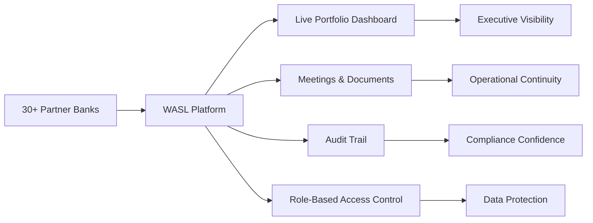

# Executive Presentation Summary

## What Is WASL?

WASL (وصل — "connection") is the organization's internal platform for managing every partner-bank relationship in one place: status, products, meetings, documents, and access — all in a single, auditable system.

## The Problem It Solves

Before WASL, bank-partnership data lived across spreadsheets, inboxes, and individual memory. There was no single view of portfolio health, no reliable audit trail, and no consistent access control over sensitive partner information.

## The Solution, In One Picture

## Key Numbers (Current State)

- **30** banks currently tracked in the portfolio.
- **5** distinct user roles with granular, per-permission access control.
- **100%** of mutating actions captured in an immutable audit trail.
- **2-factor** protection (session + PIN) on the most sensitive administrative actions.

## Business Value Delivered

| Before | After WASL |
|---|---|
| Manual status reporting to leadership | Live dashboard, always current |
| No record of who changed what | Full, queryable Activity Timeline |
| Documents scattered across drives/email | Centralized, access-controlled document storage |
| Broad, undifferentiated system access | Role- and permission-scoped access, PIN-gated admin actions |

## What's Next

- Near-term hardening: tighter archive/restore permissions, safer undo for admin mistakes, verified end-to-end document workflows.
- Medium-term: relationship health scoring and risk trend analytics to move from reporting to proactive insight.
- Long-term: potential expansion to additional partner types or organizational units.

## Why This Matters to Leadership

WASL converts an informal, person-dependent process into a governed system — reducing operational risk, supporting compliance obligations, and giving leadership a real-time, trustworthy view of the bank-partnership portfolio without waiting on manual status updates.

## Documentation Package

This executive summary is backed by a full 24-document technical and business package (see `/docs`), covering vision, architecture, data model, security, APIs, and roadmap — ensuring the platform can be confidently maintained and extended by any future engineering team.
